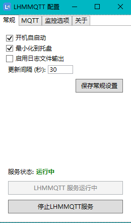

# LHMMQTT: 带可视化界面的Windows硬件监控与MQTT上报工具

## 项目简介

LHMMQTT 是一个专为 Windows 操作系统设计的轻量级工具，用于实时监控您的计算机硬件状态（如 CPU 温度、内存使用率、GPU 负载等），并通过 MQTT 协议将这些数据上报到指定的 MQTT 代理。它旨在与 Home Assistant 无缝集成，但也可用于任何支持 MQTT 的系统。

**特别注明：** 本项目基于 [@BradSimard/LHMMQTT](https://github.com/BradSimard/LHMMQTT) 项目进行开发，并在其基础上添加了直观的可视化操作 UI，提升了用户体验和配置便利性。
基于MICROSOFT .NET 8.0框架，使用前请安装8.0运行时，已安装可忽略，点击这里下载安装.NET 8.0框架[x86](https://dotnet.microsoft.com/zh-cn/download/dotnet/thank-you/runtime-desktop-8.0.16-windows-x86-installer)  ,[x64](https://dotnet.microsoft.com/zh-cn/download/dotnet/thank-you/runtime-desktop-8.0.16-windows-x64-installer)

## 主要特性

*   **实时硬件监控:** 获取 CPU、GPU、内存、主板、控制器、网络和存储设备的详细传感器数据。
*   **MQTT 集成:** 通过 MQTT 协议发布传感器数据，支持 QoS 设置。
*   **Home Assistant 友好:** 生成 Home Assistant 兼容的 MQTT 自动发现消息，简化集成过程。
*   **图形用户界面 (GUI):** 提供易于使用的 Windows 桌面应用程序界面，方便配置 MQTT 连接、选择监控传感器、管理服务启停。
*   **后台服务模式:** 应用程序最小化后可运行在系统托盘，作为后台服务持续监控和上报数据。
*   **开机自启动:** 支持配置开机自动启动，实现无人值守监控。
*   **稳健的服务管理:** 优化了服务的启动、停止和应用程序退出逻辑，确保进程的干净终止和资源的正确释放。

## 架构概览

LHMMQTT 采用模块化设计，主要由以下几个核心部分组成：

*   **LibreHardwareMonitorLib:** 用于从 Windows 硬件获取详尽的传感器数据。
*   **MQTTClient:** 负责与 MQTT 代理进行通信，发送和接收 MQTT 消息。
*   **MqttUpdateService:** 作为核心业务逻辑层，管理传感器数据的更新频率、MQTT 客户端的生命周期以及与硬件监控的交互。
*   **WPF 用户界面 (MainWindow):** 提供图形化配置界面和服务的启停控制，增强了用户交互性。
*   **Serilog:** 用于日志记录，方便诊断和排查问题。

## 使用方法

### 前期准备

1.  **安装 .NET 运行时:** 确保您的 Windows 系统已安装 .NET 8.0 或更高版本的桌面运行时。
2.  **准备 MQTT 代理:** 您需要一个可用的 MQTT 代理（例如 Mosquitto、EMQX）来接收传感器数据。
3.  **（可选）Home Assistant:** 如果您计划与 Home Assistant 集成，请确保 Home Assistant 的 MQTT 集成已配置并启用自动发现。

### 配置与运行

1.  **启动应用程序:** 运行 LHMMQTT 可执行文件。
2.  **配置 MQTT 设置:**
    *   在 UI 界面中，输入您的 MQTT 代理的主机名、端口、用户名和密码。
    *   点击"保存 MQTT 设置"按钮保存配置。
3.  **选择监控项:**
    *   在 UI 界面中，勾选您希望监控的硬件传感器类型（如 CPU、GPU、内存等）。
    *   点击"保存监控项设置"按钮保存配置。
4.  **配置常规设置:**
    *   设置更新间隔（数据上报频率）。
    *   选择是否开机自启动。
    *   选择是否最小化到托盘。
    *   点击"保存常规设置"按钮保存配置。
5.  **启动服务:** 点击"启动 LHMMQTT 服务"按钮。服务将在后台开始运行，并周期性地将传感器数据上报到 MQTT 代理。
6.  **停止服务:** 点击"停止 LHMMQTT 服务"按钮。应用程序将进行资源清理和安全退出。
7.  **开启日志:** 
    *   进入logs目录，查看当天日志，可查看到运行详情及MQTT发布的topic情况
    *   根据需要添加topic到其他MQTT客户端订阅即可获取数据
    *   日常使用建议关闭日志，避免日志文件过大占用磁盘空间

